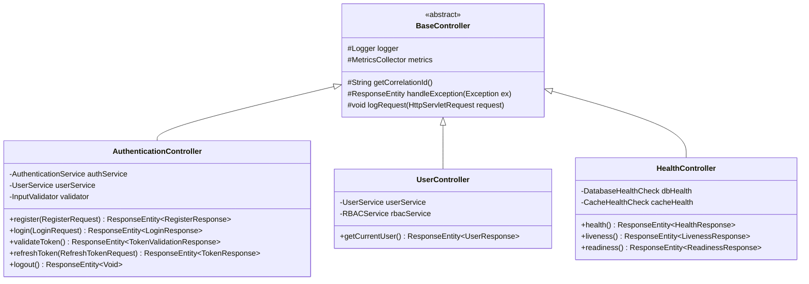
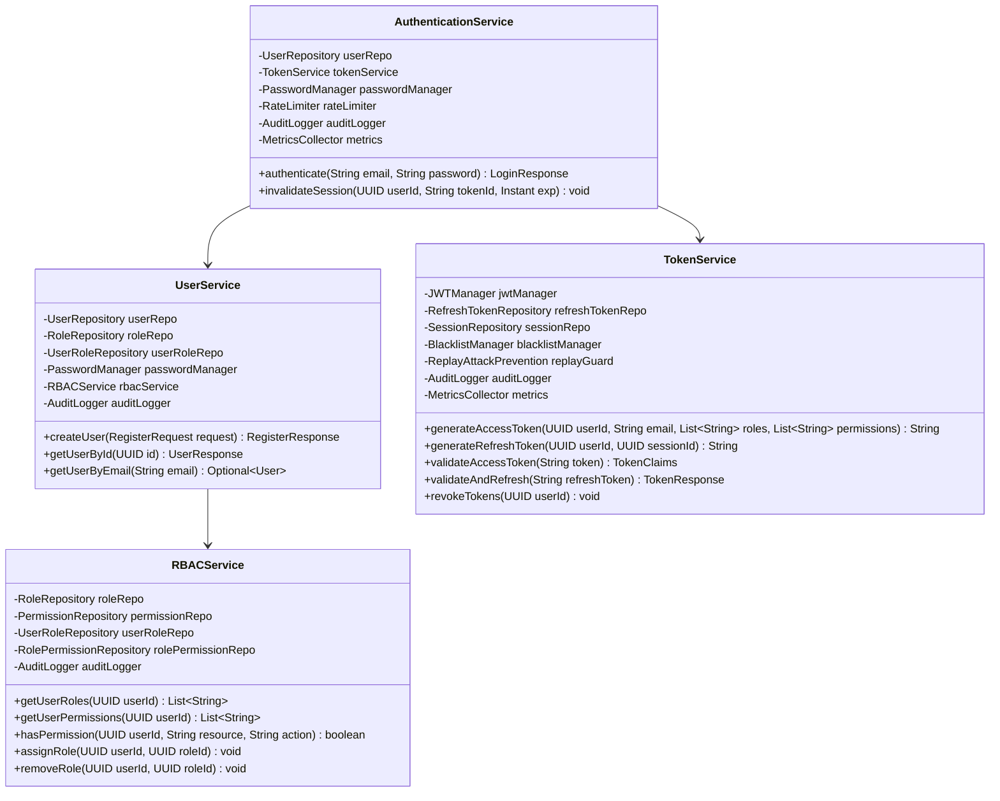

# Class Diagram - AuthService2

## Overview
This document contains class diagrams showing the domain model, service layer, security components, and data access layer based on the Authentication Service Requirements.

---

## 1. Domain Model (Section 7: Data Model Requirements)

```mermaid
classDiagram
    class User {
        -UUID id
        -String firstName
        -String lastName
        -String email
        -String passwordHash
        -UserStatus status
        -Integer failedLoginAttempts
        -LocalDateTime lockedUntil
        -LocalDateTime createdAt
        -LocalDateTime updatedAt
        -LocalDateTime lastLoginAt
        +getId() UUID
        +getEmail() String
        +getPasswordHash() String
        +getStatus() UserStatus
        +isActive() boolean
        +isLocked() boolean
        +incrementFailedAttempts() void
        +resetFailedAttempts() void
        +lock(Duration duration) void
        +unlock() void
        +updateLastLogin() void
    }
    
    class UserStatus {
        <<enumeration>>
        ACTIVE
        PENDING
        LOCKED
        DISABLED
    }
    
    class Role {
        -UUID id
        -String name
        -String description
        -LocalDateTime createdAt
        +getId() UUID
        +getName() String
        +getDescription() String
    }
    
    class Permission {
        -UUID id
        -String name
        -String resource
        -String action
        -String description
        -LocalDateTime createdAt
        +getId() UUID
        +getName() String
        +getResource() String
        +getAction() String
        +matches(String resource, String action) boolean
    }
    
    class UserRole {
        -UUID userId
        -UUID roleId
        -LocalDateTime assignedAt
        -UUID assignedBy
        +getUserId() UUID
        +getRoleId() UUID
        +getAssignedAt() LocalDateTime
    }
    
    class RolePermission {
        -UUID roleId
        -UUID permissionId
        +getRoleId() UUID
        +getPermissionId() UUID
    }
    
    class RefreshToken {
        -UUID id
        -UUID userId
        -String tokenHash
        -UUID sessionId
        -UUID tokenFamilyId
        -RefreshTokenStatus status
        -LocalDateTime issuedAt
        -LocalDateTime expiresAt
        -LocalDateTime rotatedAt
        -LocalDateTime revokedAt
        +getId() UUID
        +getUserId() UUID
        +getTokenHash() String
        +isValid() boolean
        +isExpired() boolean
        +rotate() void
        +revoke() void
    }
    
    class RefreshTokenStatus {
        <<enumeration>>
        ACTIVE
        ROTATED
        REVOKED
        EXPIRED
    }
    
    class Session {
        -UUID id
        -UUID userId
        -SessionStatus status
        -String ipAddress
        -String userAgent
        -LocalDateTime createdAt
        -LocalDateTime lastSeenAt
        -LocalDateTime revokedAt
        +getId() UUID
        +getUserId() UUID
        +isActive() boolean
        +updateLastSeen() void
        +revoke() void
    }
    
    class SessionStatus {
        <<enumeration>>
        ACTIVE
        REVOKED
        EXPIRED
    }
    
    class AuditLog {
        -UUID id
        -UUID userId
        -String action
        -String resource
        -String ipAddress
        -String userAgent
        -LocalDateTime timestamp
        -String details
        -String correlationId
        +getId() UUID
        +getUserId() UUID
        +getAction() String
        +getTimestamp() LocalDateTime
    }

    User ||--o{ UserRole : has
    Role ||--o{ UserRole : assigned
    Role ||--o{ RolePermission : has
    Permission ||--o{ RolePermission : granted
    User ||--o{ RefreshToken : owns
    User ||--o{ Session : has
    User ||--o{ AuditLog : generates
    User --> UserStatus
    RefreshToken --> RefreshTokenStatus
    Session --> SessionStatus
```

---

## 2. Controller Layer (API Endpoints from Section 9)



---

## 3. Service Layer (Requirements AUTH-FR-001 through AUTH-FR-007)



---

## 4. Security Components

```mermaid
classDiagram
    class PasswordManager {
        -BCryptPasswordEncoder bcryptEncoder
        -int strength
        -PasswordPolicy policy
        +hashPassword(String plainPassword) String
        +verifyPassword(String plainPassword, String hash) boolean
        +validatePasswordPolicy(String password) ValidationResult
    }
    
    class PasswordPolicy {
        -int minLength
        -boolean requireUppercase
        -boolean requireLowercase
        -boolean requireDigit
        -boolean requireSpecialChar
        +validate(String password) ValidationResult
        +getRequirements() String
    }
    
    class JWTManager {
        -Algorithm algorithm
        -String issuer
        -String audience
        -Duration accessTokenExpiry
        -Duration refreshTokenExpiry
        -SecretsManager secretsManager
        +createAccessToken(TokenClaims claims) String
        +createRefreshToken(TokenClaims claims) String
        +validateToken(String token) TokenClaims
        +extractClaims(String token) TokenClaims
        +isExpired(String token) boolean
        -sign(String payload) String
        -verify(String token) boolean
    }
    
    class TokenClaims {
        -UUID sub
        -String email
        -List~String~ roles
        -List~String~ permissions
        -String iss
        -String aud
        -Instant iat
        -Instant exp
        -UUID jti
        +getSub() UUID
        +getEmail() String
        +getRoles() List~String~
        +getPermissions() List~String~
        +getJti() UUID
        +isExpired() boolean
    }
    
    class RateLimiter {
        -RedisTemplate redisTemplate
        -RateLimitConfig config
        +checkRateLimit(String key, int limit, Duration window) boolean
        +incrementCounter(String key, Duration window) void
        +getRemainingAttempts(String key, int limit, Duration window) int
        +resetCounter(String key) void
    }
    
    class RateLimitConfig {
        -int loginAttemptsPerWindow
        -Duration loginWindow
        -int registrationAttemptsPerHour
        -int refreshAttemptsPerWindow
        -Duration refreshWindow
        -int apiCallsPerMinute
        +getLoginLimit() int
        +getLoginWindow() Duration
    }
    
    class BlacklistManager {
        -RedisTemplate redisTemplate
        -String keyPrefix
        +addToBlacklist(UUID tokenId, UUID userId, Instant expiration) void
        +isBlacklisted(UUID tokenId) boolean
        +removeFromBlacklist(UUID tokenId) void
        -calculateTTL(Instant expiration) long
    }
    
    class ReplayAttackPrevention {
        -RefreshTokenRepository refreshTokenRepo
        -SessionRepository sessionRepo
        -AuditLogger auditLogger
        +checkReuse(UUID tokenFamilyId, RefreshTokenStatus status) void
        +revokeTokenFamily(UUID tokenFamilyId) void
        +revokeSession(UUID sessionId) void
    }
    
    class InputValidator {
        -List~ValidationRule~ rules
        +validateRegistration(RegisterRequest request) ValidationResult
        +validateLogin(LoginRequest request) ValidationResult
        +validateEmail(String email) boolean
        +sanitize(String input) String
        -checkXSS(String input) boolean
        -checkSQLInjection(String input) boolean
    }
    
    class ValidationResult {
        -boolean valid
        -List~FieldError~ errors
        +isValid() boolean
        +getErrors() List~FieldError~
        +addError(String field, String message) void
    }
    
    class FieldError {
        -String field
        -String message
        +getField() String
        +getMessage() String
    }

    PasswordManager --> PasswordPolicy
    JWTManager --> TokenClaims
    RateLimiter --> RateLimitConfig
    InputValidator --> ValidationResult
    ValidationResult --> FieldError
```



---

## 5. DTOs and Request/Response Models (Section 9: API Summary)

```mermaid
classDiagram
    class RegisterRequest {
        +String firstName
        +String lastName
        +String email
        +String password
        +validate() ValidationResult
    }
    
    class RegisterResponse {
        +UUID userId
        +String email
        +UserStatus status
        +String message
    }
    
    class LoginRequest {
        +String email
        +String password
        +validate() ValidationResult
    }
    
    class LoginResponse {
        +String accessToken
        +String refreshToken
        +String tokenType
        +int expiresIn
        +UserInfo user
    }
    
    class UserInfo {
        +UUID userId
        +String email
        +List~String~ roles
    }
    
    class TokenValidationResponse {
        +boolean valid
        +UUID userId
        +String email
        +List~String~ roles
        +List~String~ permissions
        +Instant expiresAt
    }
    
    class RefreshTokenRequest {
        +String refreshToken
        +validate() ValidationResult
    }
    
    class TokenResponse {
        +String accessToken
        +String refreshToken
        +String tokenType
        +int expiresIn
    }
    
    class UserResponse {
        +UUID userId
        +String firstName
        +String lastName
        +String email
        +List~String~ roles
        +List~String~ permissions
        +UserStatus status
        +LocalDateTime createdAt
        +LocalDateTime updatedAt
    }
    
    class ErrorResponse {
        +LocalDateTime timestamp
        +int status
        +String error
        +String message
        +String path
        +String traceId
        +List~FieldError~ fieldErrors
    }
    
    class HealthResponse {
        +String status
        +Map~String,ComponentHealth~ components
        +LocalDateTime timestamp
    }
    
    class ComponentHealth {
        +String status
        +Map~String,Object~ details
    }

    LoginResponse --> UserInfo
    UserResponse --> UserStatus
    ErrorResponse --> FieldError
    HealthResponse --> ComponentHealth
```



---

## 6. Repository Layer (Data Access)

```mermaid
classDiagram
    class UserRepository {
        <<interface>>
        +findById(UUID id) Optional~User~
        +findByEmail(String email) Optional~User~
        +save(User user) User
        +delete(UUID id) void
        +existsByEmail(String email) boolean
        +findByStatus(UserStatus status) List~User~
        +updateFailedLoginAttempts(UUID id, int attempts) void
        +updateLastLogin(UUID id, LocalDateTime timestamp) void
    }
    
    class RoleRepository {
        <<interface>>
        +findById(UUID id) Optional~Role~
        +findByName(String name) Optional~Role~
        +save(Role role) Role
        +findAll() List~Role~
    }
    
    class PermissionRepository {
        <<interface>>
        +findById(UUID id) Optional~Permission~
        +findByName(String name) Optional~Permission~
        +findByResource(String resource) List~Permission~
        +save(Permission permission) Permission
    }
    
    class UserRoleRepository {
        <<interface>>
        +findByUserId(UUID userId) List~UserRole~
        +findByRoleId(UUID roleId) List~UserRole~
        +save(UserRole userRole) UserRole
        +delete(UUID userId, UUID roleId) void
        +existsByUserIdAndRoleId(UUID userId, UUID roleId) boolean
    }
    
    class RolePermissionRepository {
        <<interface>>
        +findByRoleId(UUID roleId) List~RolePermission~
        +findByPermissionId(UUID permissionId) List~RolePermission~
        +save(RolePermission rolePermission) RolePermission
    }
    
    class RefreshTokenRepository {
        <<interface>>
        +findById(UUID id) Optional~RefreshToken~
        +findByTokenHash(String hash) Optional~RefreshToken~
        +findByUserId(UUID userId) List~RefreshToken~
        +findBySessionId(UUID sessionId) List~RefreshToken~
        +findByTokenFamilyId(UUID familyId) List~RefreshToken~
        +save(RefreshToken token) RefreshToken
        +updateStatus(UUID id, RefreshTokenStatus status) void
        +deleteByUserId(UUID userId) void
        +deleteExpired() int
    }
    
    class SessionRepository {
        <<interface>>
        +findById(UUID id) Optional~Session~
        +findByUserId(UUID userId) List~Session~
        +save(Session session) Session
        +updateLastSeen(UUID id, LocalDateTime timestamp) void
        +revoke(UUID id) void
        +deleteExpired() int
    }
    
    class AuditLogRepository {
        <<interface>>
        +save(AuditLog log) AuditLog
        +findByUserId(UUID userId, Pageable pageable) Page~AuditLog~
        +findByAction(String action, Pageable pageable) Page~AuditLog~
        +findByTimeRange(LocalDateTime start, LocalDateTime end) List~AuditLog~
        +deleteOlderThan(LocalDateTime date) int
    }
```



---

## 7. Cross-Cutting Concerns

```mermaid
classDiagram
    class AuditLogger {
        -AuditLogRepository auditRepo
        -String serviceName
        +logUserRegistration(UUID userId, String email) void
        +logLoginSuccess(UUID userId, String ip, String userAgent) void
        +logLoginFailure(String email, String ip, String reason) void
        +logTokenRefresh(UUID userId, UUID sessionId) void
        +logRefreshTokenReplay(UUID userId, UUID sessionId, UUID tokenFamilyId, String ip) void
        +logLogout(UUID userId, List~UUID~ sessionIds) void
        +logTokenBlacklist(UUID tokenId, UUID userId, Instant expiration) void
        +logRBACDenial(UUID userId, String permission, String endpoint) void
    }
    
    class MetricsCollector {
        -MeterRegistry registry
        +incrementCounter(String metric, Map~String,String~ tags) void
        +recordTimer(String metric, long duration, TimeUnit unit) void
        +gaugeValue(String metric, double value) void
        +getMetric(String name) Metric
    }
    
    class StructuredLogger {
        -Logger logger
        +info(String message, Map~String,Object~ context) void
        +warn(String message, Map~String,Object~ context) void
        +error(String message, Throwable ex, Map~String,Object~ context) void
        -sanitize(Map~String,Object~ context) Map~String,Object~
        -buildLogEntry(String message, Map~String,Object~ context) String
    }
    
    class SecretsManager {
        -AWSSecretsManager client
        -Map~String,String~ cache
        -Duration cacheTTL
        +getSecret(String key) String
        +refreshSecret(String key) String
        +rotateSecret(String key) void
        -loadFromAWS(String key) String
    }
```



---

## 8. Exception Hierarchy (Section 10: Error Response Standard)

```mermaid
classDiagram
    class ServiceException {
        <<abstract>>
        #String message
        #String errorCode
        #HttpStatus httpStatus
        #String traceId
        +getMessage() String
        +getErrorCode() String
        +getHttpStatus() HttpStatus
        +getTraceId() String
    }
    
    class AuthenticationException {
        +AuthenticationException(String message)
        +AuthenticationException(String message, String errorCode)
    }
    
    class InvalidCredentialsException {
        +InvalidCredentialsException()
    }
    
    class TokenInvalidException {
        +TokenInvalidException(String reason)
    }
    
    class TokenExpiredException {
        +TokenExpiredException()
    }
    
    class TokenRevokedException {
        +TokenRevokedException()
    }
    
    class AuthorizationException {
        -String requiredPermission
        +AuthorizationException(String permission)
        +getRequiredPermission() String
    }
    
    class ValidationException {
        -List~FieldError~ fieldErrors
        +ValidationException(List~FieldError~ errors)
        +getFieldErrors() List~FieldError~
    }
    
    class ConflictException {
        +ConflictException(String message)
    }
    
    class ResourceNotFoundException {
        +ResourceNotFoundException(String resource, UUID id)
    }
    
    class RateLimitExceededException {
        -int retryAfterSeconds
        +RateLimitExceededException(int retryAfter)
        +getRetryAfter() int
    }
    
    class AccountLockedException {
        -LocalDateTime lockedUntil
        +AccountLockedException(LocalDateTime until)
        +getLockedUntil() LocalDateTime
    }
    
    class RefreshTokenReusedException {
        +RefreshTokenReusedException(UUID sessionId)
    }
    
    class ReplayDetectedException {
        -UUID tokenFamilyId
        +ReplayDetectedException(UUID familyId)
        +getTokenFamilyId() UUID
    }

    ServiceException <|-- AuthenticationException
    ServiceException <|-- AuthorizationException
    ServiceException <|-- ValidationException
    ServiceException <|-- ConflictException
    ServiceException <|-- ResourceNotFoundException
    ServiceException <|-- RateLimitExceededException
    AuthenticationException <|-- InvalidCredentialsException
    AuthenticationException <|-- TokenInvalidException
    AuthenticationException <|-- TokenExpiredException
    AuthenticationException <|-- TokenRevokedException
    AuthenticationException <|-- AccountLockedException
    AuthenticationException <|-- RefreshTokenReusedException
    AuthenticationException <|-- ReplayDetectedException
```



---

## 9. Configuration Classes (Section 13: Configuration Requirements)

```mermaid
classDiagram
    class SecurityConfig {
        -JWTManager jwtManager
        -PasswordManager passwordManager
        +securityFilterChain() SecurityFilterChain
        +corsConfigurationSource() CorsConfigurationSource
        +authenticationManager() AuthenticationManager
    }
    
    class JWTConfig {
        +String issuer
        +String audience
        +Duration accessTokenExpiry
        +Duration refreshTokenExpiry
        +String algorithm
        +getIssuer() String
        +getAccessTokenExpiry() Duration
    }
    
    class PasswordConfig {
        +int bcryptStrength
        +int minPasswordLength
        +boolean requireUppercase
        +boolean requireLowercase
        +boolean requireDigit
        +boolean requireSpecialChar
    }
    
    class RateLimitConfigProperties {
        +int loginAttemptsPerWindow
        +Duration loginWindow
        +int registrationPerHour
        +int refreshPerWindow
        +Duration refreshWindow
        +int apiCallsPerMinute
    }
    
    class DatabaseConfig {
        +String url
        +String username
        +String driverClassName
        +int maxPoolSize
        +int minIdle
        +boolean sslEnabled
    }
    
    class RedisConfig {
        +String host
        +int port
        +String password
        +Duration defaultTTL
        +int maxConnections
        +boolean sslEnabled
    }
    
    class ObservabilityConfig {
        +String logLevel
        +String logFormat
        +boolean metricsEnabled
        +String metricsPrefix
        +boolean tracingEnabled
        +int auditLogRetentionDays
    }
```



---

## Design Patterns Applied

### 1. Repository Pattern
- **Purpose**: Abstracts data access logic
- **Classes**: UserRepository, RoleRepository, RefreshTokenRepository, etc.
- **Benefit**: Clean separation between domain and data layers

### 2. Service Layer Pattern
- **Purpose**: Business logic encapsulation
- **Classes**: AuthenticationService, UserService, TokenService, RBACService
- **Benefit**: Transaction boundaries, reusable service components

### 3. DTO Pattern
- **Purpose**: Separates internal models from API contracts
- **Classes**: RegisterRequest, LoginResponse, UserResponse, etc.
- **Benefit**: API versioning support, prevents over-posting attacks

### 4. Strategy Pattern
- **Purpose**: Algorithm selection at runtime
- **Implementation**: Password hashing strategies (bcrypt)
- **Benefit**: Flexibility to change algorithms

### 5. Builder Pattern
- **Purpose**: Complex object construction
- **Implementation**: JWT claims building, Response building
- **Benefit**: Readable and maintainable object creation

### 6. Chain of Responsibility
- **Purpose**: Request processing pipeline
- **Implementation**: Security filter chain, validation pipeline
- **Benefit**: Flexible request processing

### 7. Template Method
- **Purpose**: Common algorithm structure with customization points
- **Implementation**: BaseController with overridable methods
- **Benefit**: Code reuse and consistency

### 8. Observer Pattern
- **Purpose**: Event-driven notifications
- **Implementation**: Audit logging, metrics collection
- **Benefit**: Loose coupling for cross-cutting concerns

---

## SOLID Principles Application

### Single Responsibility Principle (SRP)
- Each class has one reason to change
- Controllers handle HTTP, Services handle business logic, Repositories handle data access
- Security components have focused responsibilities

### Open/Closed Principle (OCP)
- Services are open for extension (interfaces) but closed for modification
- New validators can be added without modifying InputValidator

### Liskov Substitution Principle (LSP)
- All implementations can replace their interfaces
- Exception hierarchyallows substitution of specific exceptions with base

### Interface Segregation Principle (ISP)
- Small, focused interfaces (UserRepository, TokenService methods)
- No fat interfaces forcing unnecessary implementations

### Dependency Inversion Principle (DIP)
- High-level modules depend on abstractions (interfaces)
- Controllers depend on Service interfaces, not implementations
- Services depend on Repository interfaces

---

## Security Considerations in Design

### 1. **Immutability**
- DTOs are immutable
- Token claims are final
- Configuration objects are read-only after initialization

### 2. **Validation at Boundaries**
- All user input validated in controllers using InputValidator
- DTOs have validation methods
- Database constraints as final defense layer

### 3. **Fail-Safe Defaults**
- Users are inactive until verified
- Permissions are deny-by-default
- Rate limits fail closed (deny access)

### 4. **Defense in Depth**
- Multiple layers: WAF → Input Validation → Business Logic → Data Access
- Each layer enforces its own security controls

### 5. **Least Privilege**
- Services request minimum permissions needed
- Database connections have limited privileges
- RBAC enforces fine-grained access control

### 6. **Secure by Design**
- Passwords never stored in plain text (PasswordManager)
- Tokens never logged (StructuredLogger sanitization)
- Sensitive data filtered from responses (UserResponse excludes passwordHash)

---

## Class Relationships Summary

| Relationship Type | Example |
|-------------------|---------|
| Composition | User has RefreshToken, Session |
| Aggregation | Role has Permissions |
| Association | UserRole links User and Role |
| Inheritance | InvalidCredentialsException extends AuthenticationException |
| Realization | UserServiceImpl implements UserService |
| Dependency | AuthenticationService depends on TokenService |

---

## Thread Safety Considerations

- **Stateless Services**: All service classes are stateless and thread-safe
- **Repository Layer**: Spring Data JPA provides thread-safe implementations
- **Redis Operations**: RedisTemplate is thread-safe
- **Token Generation**: UUID and bcrypt operations are thread-safe
- **Metrics Collector**: MeterRegistry is thread-safe

---

## Data Model Integrity

### Primary Keys
- All entities use UUID for primary keys (distributed system friendly)
- UUIDs generated using Type 4 (random)

### Foreign Keys
- UserRole references User and Role
- RefreshToken references User and Session
- AuditLog references User

### Indexes (Performance Optimization)
- `user.email` - UNIQUE index for fast lookups
- `refresh_token.tokenHash` - index for token validation
- `refresh_token.userId` - index for user token queries
- `session.userId` - index for user session queries
- `audit_log.userId, timestamp` - composite index for audit queries

### Constraints
- Email uniqueness enforced at database level
- Cascade delete for dependent entities (sessions, tokens)
- Check constraints for status enums

