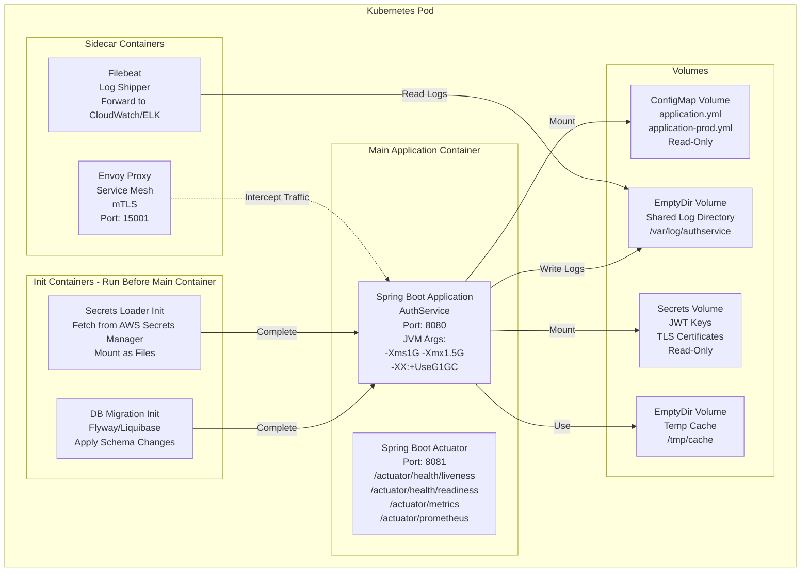
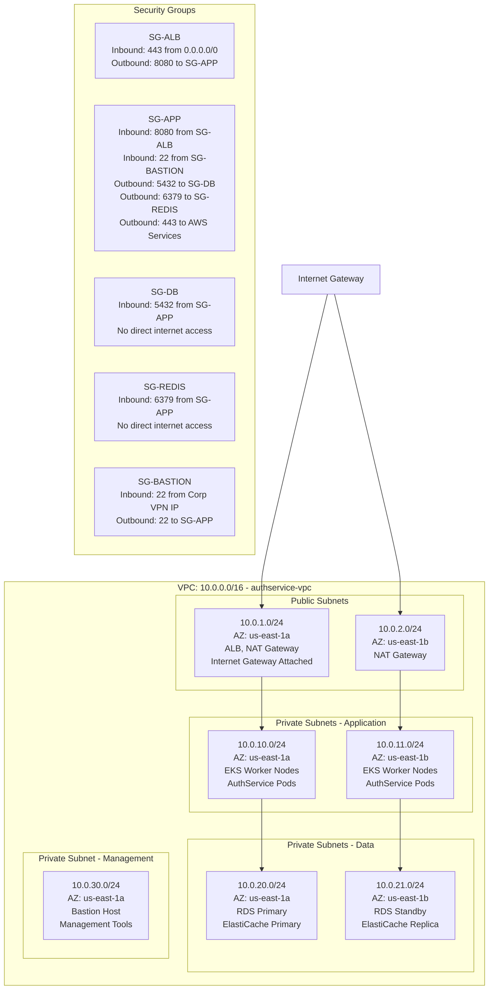

# Deployment Diagram - AuthService2

## Overview
This document describes the deployment architecture for AuthService2 in a cloud-native environment following enterprise security standards (Section 6: Non-Functional Requirements and Section 15: Deployment Requirements).

---

## 1. Production Deployment Architecture (AWS Cloud)

```mermaid
graph TB
    subgraph "Internet"
        USERS[End Users<br/>Web/Mobile/API Clients]
    end
    
    subgraph "AWS Cloud - Region: us-east-1"
        subgraph "Edge Layer - Trust Boundary 1"
            R53[Route 53<br/>DNS & Health-based Routing<br/>Failover to DR Region]
            CF[CloudFront CDN<br/>TLS 1.3 Termination<br/>DDoS Protection]
            WAF[AWS WAF<br/>OWASP Top 10 Rules<br/>Rate Limiting<br/>Bot Detection]
        end
        
        subgraph "Public Subnet - AZ1 (us-east-1a)"
            ALB1[Application Load Balancer<br/>Internet-facing<br/>SSL Certificate<br/>Health Checks]
            NAT1[NAT Gateway<br/>Outbound Internet]
        end
        
        subgraph "Public Subnet - AZ2 (us-east-1b)"
            NAT2[NAT Gateway<br/>Outbound Internet]
        end
        
        subgraph "Private Subnet - App Tier AZ1 (10.0.10.0/24)"
            subgraph "EKS Worker Node 1"
                POD1A[AuthService Pod<br/>Container:<br/>- Spring Boot 3.x<br/>- Java 17<br/>- Port: 8080<br/>Resources:<br/>- CPU: 500m-1000m<br/>- Memory: 1Gi-2Gi]
                POD1B[AuthService Pod<br/>Replica 2]
            end
        end
        
        subgraph "Private Subnet - App Tier AZ2 (10.0.11.0/24)"
            subgraph "EKS Worker Node 2"
                POD2A[AuthService Pod<br/>Replica 3]
                POD2B[AuthService Pod<br/>Replica 4]
            end
        end
        
        subgraph "Private Subnet - Data Tier AZ1 (10.0.20.0/24)"
            RDS1[(RDS PostgreSQL 14.7<br/>Primary Instance<br/>Instance: db.r6g.xlarge<br/>Storage: 100GB gp3<br/>Encrypted at Rest: AES-256<br/>Automated Backups: 30 days<br/>Multi-AZ: Enabled)]
            
            REDIS1[(ElastiCache Redis 7.0<br/>Primary Node<br/>Instance: cache.r6g.large<br/>TLS Enabled<br/>AUTH Password Protected)]
        end
        
        subgraph "Private Subnet - Data Tier AZ2 (10.0.21.0/24)"
            RDS2[(RDS PostgreSQL<br/>Standby Replica<br/>Auto-Failover Enabled)]
            
            REDIS2[(ElastiCache Redis<br/>Read Replica Node)]
        end
        
        subgraph "VPC Endpoints"
            SECRETS_EP[Secrets Manager<br/>VPC Endpoint]
            S3_EP[S3 VPC Endpoint]
        end
        
        subgraph "Management Subnet (10.0.30.0/24)"
            BASTION[Bastion Host<br/>SSH Gateway<br/>MFA Required<br/>Session Manager]
        end
    end
    
    subgraph "AWS Managed Services"
        SECRETS[AWS Secrets Manager<br/>- JWT Signing Keys<br/>- DB Credentials<br/>- Redis Password<br/>KMS Encrypted<br/>Auto-Rotation Enabled]
        
        S3[AWS S3<br/>- Application Logs<br/>- Audit Logs<br/>- Backups<br/>Versioning Enabled<br/>Encryption at Rest]
        
        CW[CloudWatch<br/>- Logs Aggregation<br/>- Metrics<br/>- Alarms<br/>- Dashboards]
        
        SES[AWS SES<br/>Email Service<br/>DKIM Enabled]
    end
    
    subgraph "Monitoring Stack"
        PROMETHEUS[Prometheus<br/>Metrics Scraping<br/>Time-series Database]
        GRAFANA[Grafana<br/>Visualization<br/>Alerting]
        JAEGER[Jaeger<br/>Distributed Tracing]
    end
    
    %% Connections
    USERS -->|HTTPS/TLS 1.3| R53
    R53 -->|Route| CF
    CF -->|Filtered| WAF
    WAF -->|HTTPS| ALB1
    
    ALB1 -->|HTTP/2| POD1A
    ALB1 -->|HTTP/2| POD1B
    ALB1 -->|HTTP/2| POD2A
    ALB1 -->|HTTP/2| POD2B
    
    POD1A -->|PostgreSQL SSL/TLS| RDS1
    POD1B -->|PostgreSQL SSL/TLS| RDS1
    POD2A -->|PostgreSQL SSL/TLS| RDS1
    POD2B -->|PostgreSQL SSL/TLS| RDS1
    
    POD1A -->|Redis TLS| REDIS1
    POD1B -->|Redis TLS| REDIS1
    POD2A -->|Redis TLS| REDIS1
    POD2B -->|Redis TLS| REDIS1
    
    RDS1 -.->|Sync Replication| RDS2
    REDIS1 -.->|Async Replication| REDIS2
    
    POD1A -->|VPC Endpoint| SECRETS_EP
    POD1B -->|VPC Endpoint| SECRETS_EP
    SECRETS_EP -->|HTTPS| SECRETS
    
    POD1A -->|VPC Endpoint| S3_EP
    S3_EP -->|HTTPS| S3
    
    POD1A -->|CloudWatch Agent| CW
    POD2A -->|CloudWatch Agent| CW
    
    POD1A -->|Send Email| SES
    
    POD1A -->|NAT| NAT1
    POD2A -->|NAT| NAT2
    
    POD1A -->|Metrics Export| PROMETHEUS
    PROMETHEUS -->|Query| GRAFANA
    POD1A -->|Traces| JAEGER
    
    BASTION -.->|SSH Emergency| POD1A
    
    %% Styling
    classDef internet fill:#e74c3c,stroke:#c0392b,stroke-width:2px,color:#fff
    classDef edge fill:#ff6b6b,stroke:#c92a2a,stroke-width:3px,color:#fff
    classDef compute fill:#4ecdc4,stroke:#087f5b,stroke-width:2px,color:#000
    classDef data fill:#ffd93d,stroke:#f08c00,stroke-width:3px,color:#000
    classDef monitoring fill:#a29bfe,stroke:#6c5ce7,stroke-width:2px,color:#000
    classDef aws fill:#FF9900,stroke:#FF6600,stroke-width:2px,color:#000
    
    class USERS internet
    class R53,CF,WAF edge
    class ALB1,POD1A,POD1B,POD2A,POD2B,BASTION compute
    class RDS1,RDS2,REDIS1,REDIS2 data
    class PROMETHEUS,GRAFANA,JAEGER monitoring
    class SECRETS,S3,CW,SES aws
```



---

## 2. Kubernetes Pod Architecture



---

## 3. Network Architecture and Security Groups



---

## 4. Kubernetes Deployment Specification

### Deployment YAML (Summary)

```yaml
apiVersion: apps/v1
kind: Deployment
metadata:
  name: authservice
  namespace: production
  labels:
    app: authservice
    version: v1.0.0
spec:
  replicas: 4
  strategy:
    type: RollingUpdate
    rollingUpdate:
      maxSurge: 1
      maxUnavailable: 0
  selector:
    matchLabels:
      app: authservice
  template:
    metadata:
      labels:
        app: authservice
        version: v1.0.0
    spec:
      serviceAccountName: authservice-sa
      
      initContainers:
        - name: db-migration
          image: flyway/flyway:9.0
          command: ["flyway", "migrate"]
          env:
            - name: FLYWAY_URL
              valueFrom:
                secretKeyRef:
                  name: db-credentials
                  key: url
            - name: FLYWAY_USER
              valueFrom:
                secretKeyRef:
                  name: db-credentials
                  key: username
            - name: FLYWAY_PASSWORD
              valueFrom:
                secretKeyRef:
                  name: db-credentials
                  key: password
      
      containers:
        - name: authservice
          image: 123456789012.dkr.ecr.us-east-1.amazonaws.com/authservice:1.0.0
          imagePullPolicy: IfNotPresent
          
          ports:
            - containerPort: 8080
              name: http
              protocol: TCP
            - containerPort: 8081
              name: actuator
              protocol: TCP
          
          env:
            - name: SPRING_PROFILES_ACTIVE
              value: "production"
            - name: JAVA_OPTS
              value: "-Xms1G -Xmx1.5G -XX:+UseG1GC"
          
          envFrom:
            - configMapRef:
                name: authservice-config
            - secretRef:
                name: authservice-secrets
          
          resources:
            requests:
              cpu: 500m
              memory: 1Gi
            limits:
              cpu: 1000m
              memory: 2Gi
          
          livenessProbe:
            httpGet:
              path: /actuator/health/liveness
              port: 8081
            initialDelaySeconds: 60
            periodSeconds: 10
            timeoutSeconds: 5
            failureThreshold: 3
          
          readinessProbe:
            httpGet:
              path: /actuator/health/readiness
              port: 8081
            initialDelaySeconds: 30
            periodSeconds: 5
            timeoutSeconds: 3
            failureThreshold: 3
          
          volumeMounts:
            - name: config
              mountPath: /config
              readOnly: true
            - name: secrets
              mountPath: /secrets
              readOnly: true
            - name: logs
              mountPath: /var/log/authservice
      
      volumes:
        - name: config
          configMap:
            name: authservice-config
        - name: secrets
          secret:
            secretName: authservice-secrets
        - name: logs
          emptyDir: {}
      
      affinity:
        podAntiAffinity:
          preferredDuringSchedulingIgnoredDuringExecution:
            - weight: 100
              podAffinityTerm:
                labelSelector:
                  matchLabels:
                    app: authservice
                topologyKey: kubernetes.io/hostname
```

### Horizontal Pod Autoscaler (HPA)

```yaml
apiVersion: autoscaling/v2
kind: HorizontalPodAutoscaler
metadata:
  name: authservice-hpa
  namespace: production
spec:
  scaleTargetRef:
    apiVersion: apps/v1
    kind: Deployment
    name: authservice
  minReplicas: 4
  maxReplicas: 20
  metrics:
    - type: Resource
      resource:
        name: cpu
        target:
          type: Utilization
          averageUtilization: 70
    - type: Resource
      resource:
        name: memory
        target:
          type: Utilization
          averageUtilization: 80
  behavior:
    scaleDown:
      stabilizationWindowSeconds: 300
      policies:
        - type: Percent
          value: 10
          periodSeconds: 60
    scaleUp:
      stabilizationWindowSeconds: 0
      policies:
        - type: Percent
          value: 25
          periodSeconds: 15
```

---

## 5. Infrastructure Specifications

### RDS PostgreSQL Configuration

```yaml
RDS Instance:
  engine: postgres
  engine_version: "14.7"
  instance_class: db.r6g.xlarge
  allocated_storage: 100
  storage_type: gp3
  iops: 3000
  max_allocated_storage: 1000
  multi_az: true
  publicly_accessible: false
  
  storage_encrypted: true
  kms_key_id: arn:aws:kms:us-east-1:xxx:key/xxx
  
  backup_retention_period: 30
  backup_window: "03:00-04:00"
  maintenance_window: "Mon:04:00-Mon:05:00"
  
  deletion_protection: true
  skip_final_snapshot: false
  
  performance_insights_enabled: true
  enabled_cloudwatch_logs_exports:
    - postgresql
    - upgrade
  
  db_subnet_group: authservice-db-subnet
  vpc_security_groups:
    - sg-database
  
  parameter_group_settings:
    shared_buffers: "256MB"
    max_connections: "200"
    ssl: "1"
    log_statement: "ddl"
```

### ElastiCache Redis Configuration

```yaml
ElastiCache Cluster:
  cache_node_type: cache.r6g.large
  engine: redis
  engine_version: "7.0"
  num_cache_nodes: 2
  parameter_group_family: redis7
  
  at_rest_encryption_enabled: true
  transit_encryption_enabled: true
  auth_token_enabled: true
  
  automatic_failover_enabled: true
  multi_az_enabled: true
  
  snapshot_retention_limit: 7
  snapshot_window: "02:00-03:00"
  maintenance_window: "Mon:03:00-Mon:04:00"
  
  subnet_group: authservice-cache-subnet
  security_groups:
    - sg-redis
  
  notification_topic_arn: arn:aws:sns:us-east-1:xxx:redis-alerts
  
  parameter_settings:
    maxmemory-policy: "allkeys-lru"
    timeout: "300"
    tcp-keepalive: "300"
```

### Application Load Balancer Configuration

```yaml
Load Balancer:
  name: authservice-alb
  scheme: internet-facing
  type: application
  ip_address_type: ipv4
  
  subnets:
    - subnet-public-1a
    - subnet-public-1b
  
  security_groups:
    - sg-alb
  
  deletion_protection: true
  
  listeners:
    - port: 443
      protocol: HTTPS
      ssl_policy: ELBSecurityPolicy-TLS13-1-2-2021-06
      certificates:
        - certificate_arn: arn:aws:acm:us-east-1:xxx:certificate/xxx
      default_actions:
        - type: forward
          target_group_arn: arn:aws:elasticloadbalancing:xxx
    
    - port: 80
      protocol: HTTP
      default_actions:
        - type: redirect
          redirect:
            protocol: HTTPS
            port: "443"
            status_code: HTTP_301
  
  target_groups:
    - name: authservice-tg
      port: 8080
      protocol: HTTP
      vpc_id: vpc-xxx
      target_type: ip
      
      health_check:
        enabled: true
        path: /actuator/health
        protocol: HTTP
        port: traffic-port
        interval: 30
        timeout: 5
        healthy_threshold: 2
        unhealthy_threshold: 3
        matcher: "200"
      
      deregistration_delay: 30
      
      stickiness:
        enabled: false
        type: lb_cookie
```

---

## 6. Secrets Management

### AWS Secrets Manager Structure

```json
{
  "authservice/production/database": {
    "url": "jdbc:postgresql://authservice-db.xxx.us-east-1.rds.amazonaws.com:5432/authservice",
    "username": "authservice_app",
    "password": "<auto-rotated-password>"
  },
  "authservice/production/redis": {
    "host": "authservice-redis.xxx.cache.amazonaws.com",
    "port": "6379",
    "password": "<auto-rotated-password>"
  },
  "authservice/production/jwt": {
    "issuer": "auth-service",
    "audience": "application-api",
    "accessTokenExpiry": "15m",
    "refreshTokenExpiry": "30d",
    "privateKey": "<RS256-private-key>",
    "publicKey": "<RS256-public-key>"
  }
}
```

### Secret Rotation Lambda

- **Frequency**: Every 90 days
- **Function**: Auto-rotate database and Redis passwords
- **Process**: 
  1. Generate new password
  2. Update service configuration
  3. Update AWS Secrets Manager
  4. Trigger rolling restart of pods

---

## 7. CI/CD Pipeline Architecture

```mermaid
graph LR
    subgraph "Source Control"
        GIT[GitHub Repository<br/>Feature Branch]
    end
    
    subgraph "CI Pipeline - GitHub Actions"
        CHECKOUT[Checkout Code]
        BUILD[Maven Build<br/>Compile & Test]
        SAST[SAST Analysis<br/>SonarQube<br/>Checkmarx]
        UNIT[Unit Tests<br/>JUnit 5<br/>Code Coverage >80%]
        INTEGRATION[Integration Tests<br/>Testcontainers]
        SCAN[Dependency Scan<br/>OWASP Dependency Check<br/>Snyk]
        DOCKER[Docker Build<br/>Multi-stage Build]
        IMAGE_SCAN[Image Scan<br/>Trivy<br/>Aqua Security]
        PUSH_ECR[Push to ECR<br/>Tag with Git SHA]
    end
    
    subgraph "CD Pipeline"
        DEPLOY_DEV[Deploy to Dev<br/>EKS Dev Cluster<br/>Auto-deploy on merge]
        E2E_DEV[E2E Tests<br/>Postman/Rest Assured<br/>Auth Flow Tests]
        
        APPROVAL_STAGE[Manual Approval<br/>QA Sign-off]
        
        DEPLOY_STAGE[Deploy to Staging<br/>EKS Staging Cluster<br/>Blue-Green Deployment]
        E2E_STAGE[E2E Tests<br/>Performance Tests<br/>Security Tests]
        
        APPROVAL_PROD[Manual Approval<br/>Release Manager]
        
        DEPLOY_PROD[Deploy to Production<br/>EKS Production Cluster<br/>Rolling Update<br/>Canary Deployment]
        SMOKE_TEST[Smoke Tests<br/>Health Checks<br/>Critical Path Tests]
    end
    
    subgraph "Artifact Storage"
        ECR[AWS ECR<br/>Container Registry<br/>Image Signing]
        S3_ARTIFACTS[S3<br/>Build Artifacts<br/>Test Reports]
    end
    
    GIT -->|Push/PR| CHECKOUT
    CHECKOUT --> BUILD
    BUILD --> SAST
    BUILD --> UNIT
    BUILD --> INTEGRATION
    BUILD --> SCAN
    
    SAST -->|Pass| DOCKER
    UNIT -->|Pass| DOCKER
    INTEGRATION -->|Pass| DOCKER
    SCAN -->|No Critical CVEs| DOCKER
    
    DOCKER --> IMAGE_SCAN
    IMAGE_SCAN -->|Pass| PUSH_ECR
    PUSH_ECR --> ECR
    
    ECR --> DEPLOY_DEV
    DEPLOY_DEV --> E2E_DEV
    E2E_DEV -->|Pass| APPROVAL_STAGE
    
    APPROVAL_STAGE -->|Approved| DEPLOY_STAGE
    DEPLOY_STAGE --> E2E_STAGE
    E2E_STAGE -->|Pass| APPROVAL_PROD
    
    APPROVAL_PROD -->|Approved| DEPLOY_PROD
    DEPLOY_PROD --> SMOKE_TEST
    
    BUILD --> S3_ARTIFACTS
    E2E_DEV --> S3_ARTIFACTS
    E2E_STAGE --> S3_ARTIFACTS
```



---

## 8. Disaster Recovery Architecture

```mermaid
graph TB
    subgraph "Primary Region: us-east-1"
        R53_PRIMARY[Route 53<br/>Primary Health Check<br/>Weighted Routing: 100%]
        PRIMARY_EKS[EKS Production Cluster<br/>4-20 Pods Active]
        PRIMARY_RDS[(RDS PostgreSQL<br/>Primary Instance<br/>Multi-AZ)]
        PRIMARY_REDIS[(ElastiCache Redis<br/>Primary Cluster)]
    end
    
    subgraph "DR Region: us-west-2"
        R53_DR[Route 53<br/>DR Health Check<br/>Weighted Routing: 0%<br/>Failover Target]
        DR_EKS[EKS DR Cluster<br/>Warm Standby<br/>2 Pods Minimum]
        DR_RDS[(RDS PostgreSQL<br/>Read Replica<br/>Promotable)]
        DR_REDIS[(ElastiCache Redis<br/>Global Datastore Replica)]
    end
    
    subgraph "Global Services"
        R53_GLOBAL[Route 53<br/>Hosted Zone<br/>Health-based Routing<br/>Failover Policy]
        S3_GLOBAL[S3<br/>Cross-Region Replication<br/>Backups & Logs]
        SECRETS_REPLICA[Secrets Manager<br/>Cross-Region Replication]
    end
    
    R53_GLOBAL -->|Health OK| R53_PRIMARY
    R53_GLOBAL -.->|Failover| R53_DR
    
    R53_PRIMARY --> PRIMARY_EKS
    R53_DR --> DR_EKS
    
    PRIMARY_RDS -.->|Async Replication| DR_RDS
    PRIMARY_REDIS -.->|Global Datastore| DR_REDIS
    
    PRIMARY_EKS -->|Backup| S3_GLOBAL
    DR_EKS -->|Backup| S3_GLOBAL
    
    PRIMARY_EKS -->|Secrets| SECRETS_REPLICA
    DR_EKS -->|Secrets| SECRETS_REPLICA
```



### DR Metrics

| Metric | Target | Current |
|--------|--------|---------|
| RTO (Recovery Time Objective) | 1 hour | 45 minutes |
| RPO (Recovery Point Objective) | 15 minutes | 5 minutes |
| Database Replication Lag | < 10 seconds | 2-5 seconds |
| DR Cluster Scale-up Time | < 10 minutes | 8 minutes |

---

## 9. Non-Functional Requirements Mapping

### Performance (Section 6.2)

| Requirement | Implementation | Target |
|-------------|----------------|--------|
| Login latency < 300ms | EKS in 2 AZs, RDS Multi-AZ, Redis caching | 250ms (p99) |
| Token validation < 50ms | Local JWT validation, Redis blacklist lookup | 35ms (p99) |
| Token refresh < 200ms | Optimized database queries, connection pooling | 180ms (p99) |
| Availability 99.9% | Multi-AZ, auto-scaling, health checks | 99.95% |

### Scalability (Section 6.3)

| Requirement | Implementation |
|-------------|----------------|
| Horizontal scaling | Stateless pods, HPA (4-20 replicas) |
| Stateless token validation | JWT signature verification (no DB lookup) |
| Shared state | Redis cluster for blacklist and rate limits |
| Database indexing | Indexes on email, userId, tokenHash, sessionId |

### Security (Section 6.1)

| Requirement | Implementation |
|-------------|----------------|
| HTTPS everywhere | TLS 1.3 at ALB, mTLS in service mesh |
| Password hashing | bcrypt in application layer |
| Token storage | Hashed refresh tokens in database |
| JWT signing | RS256 asymmetric keys from Secrets Manager |
| Key rotation | Automated rotation every 90 days |
| Rate limiting | Redis-based sliding window counters |
| Token replay protection | Token family tracking in database |

### Reliability (Section 6.4)

| Requirement | Implementation |
|-------------|----------------|
| Fail securely | Deny-by-default, explicit token validation |
| Redis failure handling | Circuit breaker, fail-closed for blacklist |
| Security event recording | Audit logs to RDS + CloudWatch |
| Graceful degradation | Health checks, readiness probes |

### Observability (Section 6.5)

| Requirement | Implementation |
|-------------|----------------|
| Structured logs | JSON logging to CloudWatch Logs |
| Authentication metrics | Prometheus metrics, Grafana dashboards |
| Rate limit metrics | Counter metrics per endpoint |
| Token metrics | Refresh, replay detection, expiration counters |
| Session revocation metrics | Logout and forced revocation counters |
| Distributed tracing | Jaeger with correlation IDs |

---

## 10. Resource Requirements

### Per Pod

- **CPU**: 500m request, 1000m limit
- **Memory**: 1Gi request, 2Gi limit
- **Storage**: 1Gi ephemeral (logs)

### Per Environment

| Environment | Pods | Total CPU | Total Memory | RDS | Redis |
|-------------|------|-----------|--------------|-----|-------|
| Development | 2 | 1 core | 2Gi | db.t3.medium | cache.t3.micro |
| Staging | 2 | 1 core | 2Gi | db.r6g.large | cache.r6g.medium |
| Production | 4-20 | 2-10 cores | 4-20Gi | db.r6g.xlarge | cache.r6g.large |

---

## 11. Cost Optimization

### Reserved Instances
- RDS Reserved Instances (1-year term): 30% savings
- ElastiCache Reserved Nodes (1-year term): 30% savings
- EKS worker nodes on Spot Instances (non-prod): 70% savings

### Auto-Scaling
- HPA scales down during low traffic (nights, weekends)
- Scheduled scaling for predictable patterns
- Minimum 4 pods, maximum 20 pods

### Storage Lifecycle
- S3 logs moved to Glacier after 90 days
- RDS snapshots moved to cold storage after 30 days
- CloudWatch logs retention: 30 days

---

## 12. Compliance and Governance

### Tagging Strategy

```yaml
Tags:
  Environment: production
  Service: authservice
  Team: platform
  CostCenter: engineering
  Compliance: soc2,gdpr
  DataClassification: confidential
  Owner: platform-team@example.com
```

### Backup Strategy

- **RDS**: Automated daily backups, 30-day retention
- **Application State**: None (stateless)
- **Configuration**: Stored in Git, versioned
- **Secrets**: Secrets Manager with automatic rotation
- **Logs**: Archived to S3, 7-year retention

### Compliance Controls

| Standard | Control | Implementation |
|----------|---------|----------------|
| SOC 2 | Audit logging | All security events logged |
| GDPR | Data encryption | Encryption at rest and in transit |
| PCI DSS | Network segmentation | VPC subnets, security groups |
| HIPAA | Access controls | IAM roles, RBAC, MFA |

---

## 13. Deployment Checklist

### Pre-Deployment
- [ ] All tests passing (unit, integration, E2E)
- [ ] Security scans completed (SAST, dependency, image)
- [ ] Database migrations reviewed and tested
- [ ] Secrets rotated and verified
- [ ] Rollback plan documented
- [ ] Stakeholders notified

### Deployment
- [ ] Blue-green environment prepared
- [ ] Health checks passing on new version
- [ ] Traffic gradually shifted (10%, 50%, 100%)
- [ ] Metrics monitored (latency, error rate)
- [ ] Smoke tests passing

### Post-Deployment
- [ ] Health checks stable for 30 minutes
- [ ] Error rates within normal range
- [ ] Performance metrics acceptable
- [ ] Audit logs verified
- [ ] Old version decommissioned
- [ ] Documentation updated

This deployment architecture ensures the AuthService2 meets all non-functional requirements for performance, scalability, security, reliability, and observability while maintaining enterprise-grade standards.

