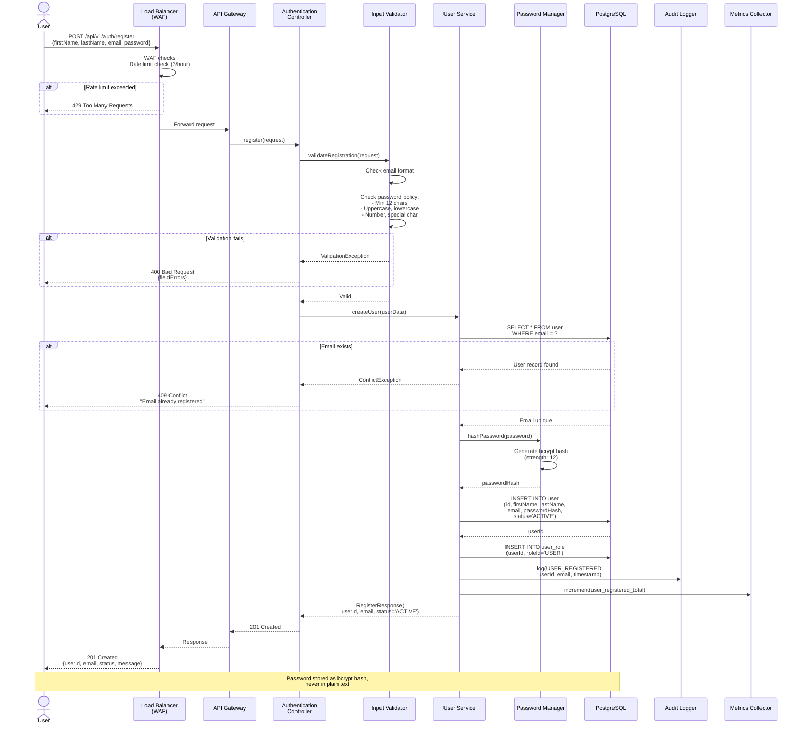
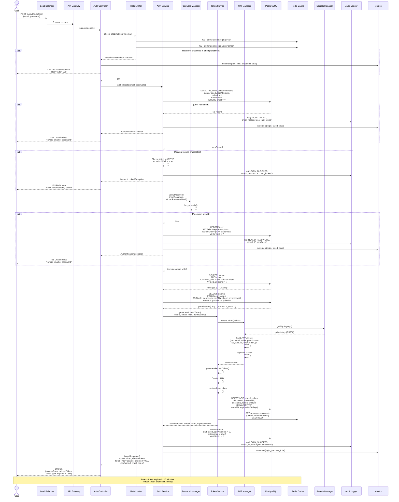
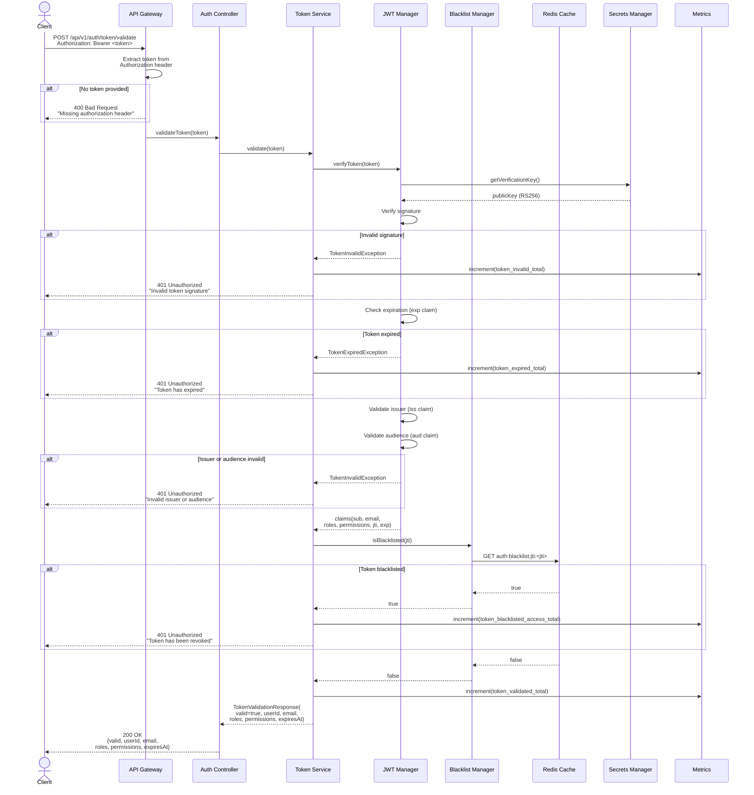
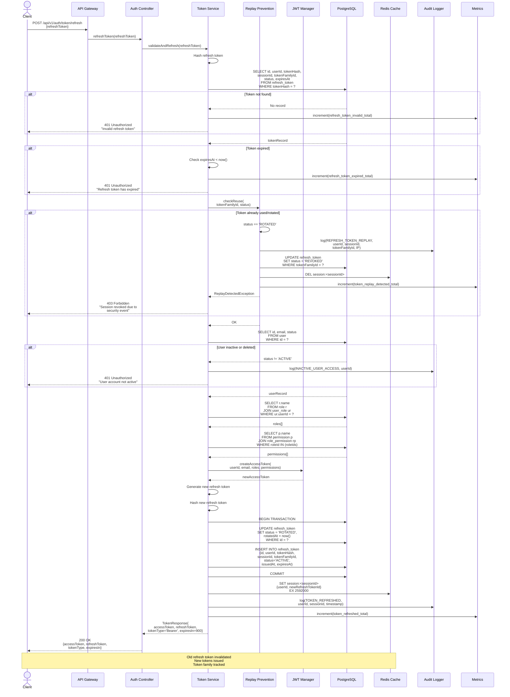
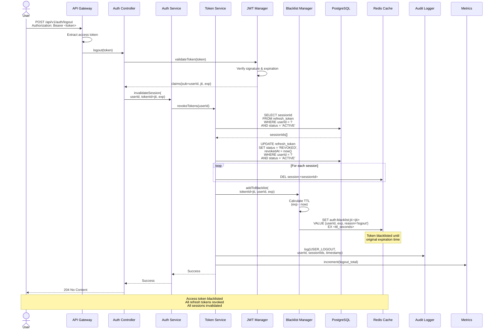
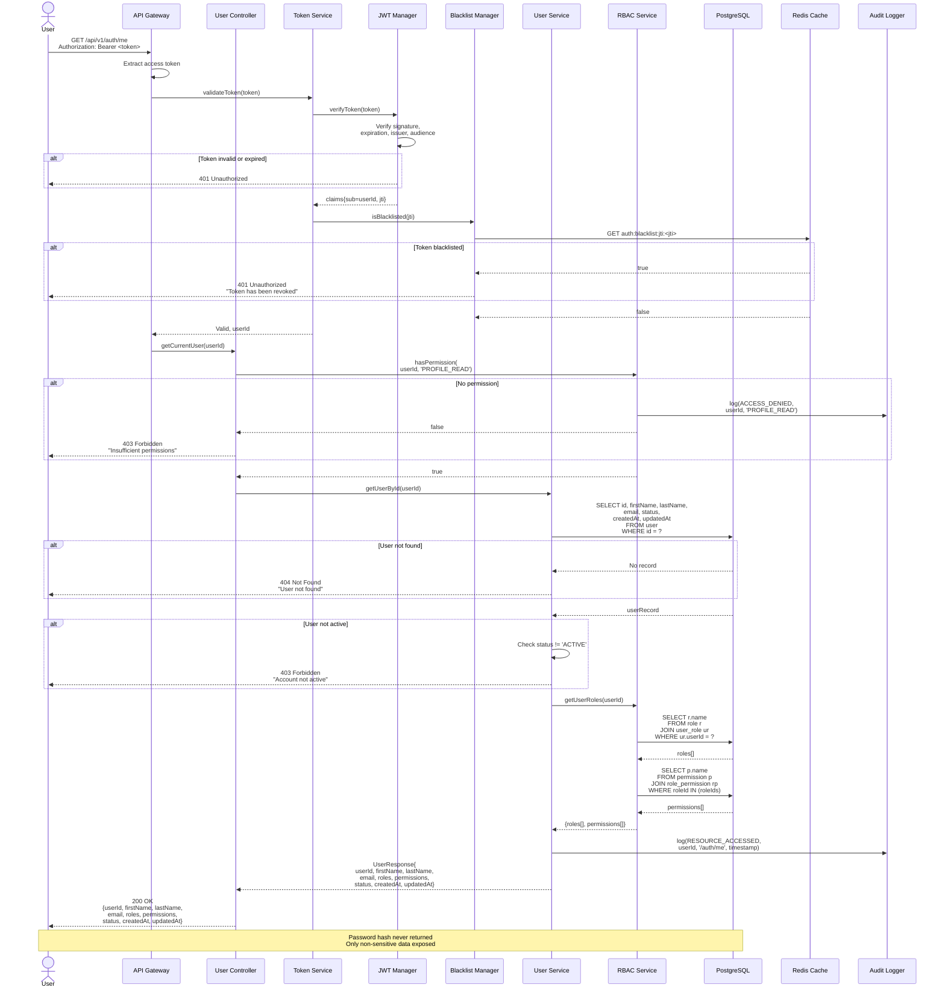
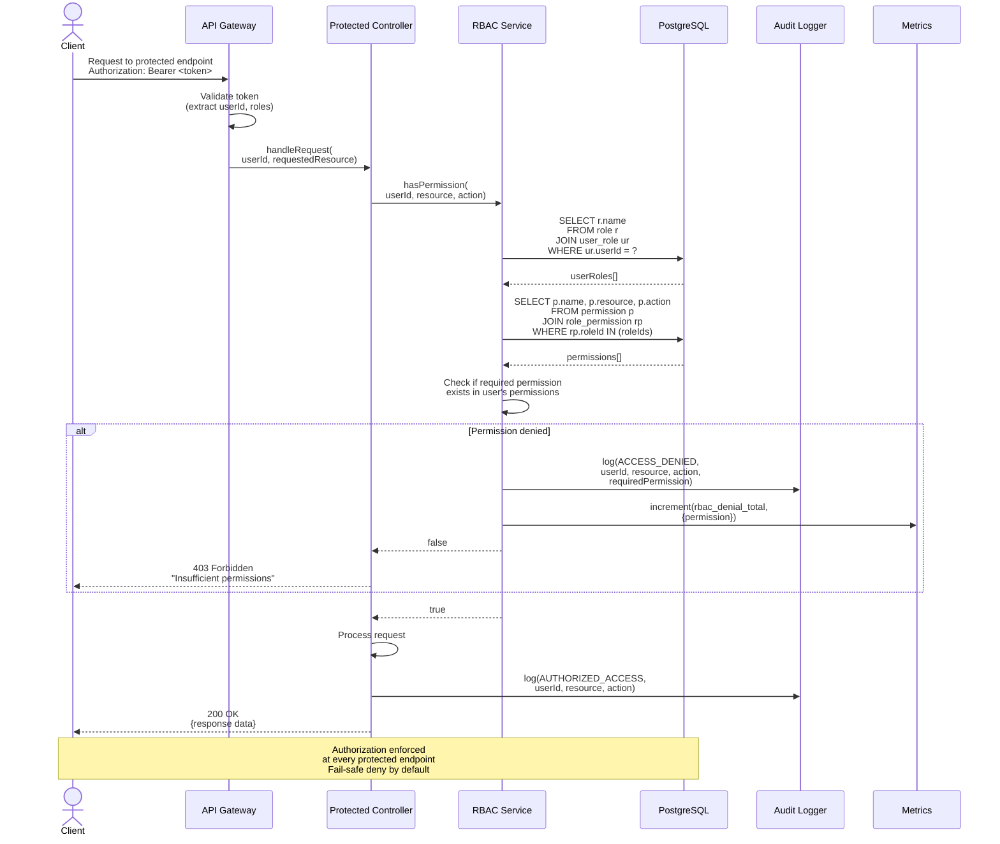
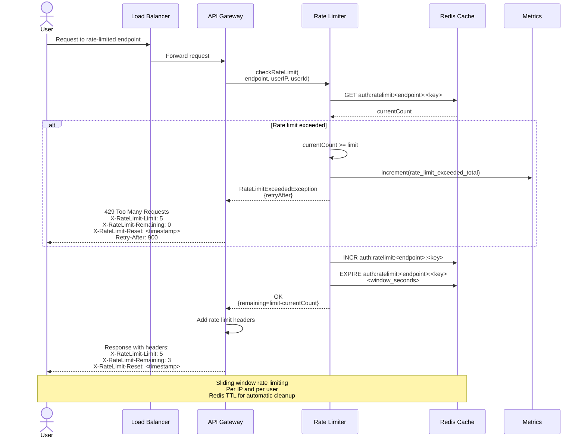

# Sequence Diagrams - AuthService2

## Overview
This document contains sequence diagrams for all authentication flows defined in the Authentication Service Requirements (AUTH-FR-001 through AUTH-FR-007).

---

## 1. User Registration Flow (AUTH-FR-001)

---

## 2. User Login Flow (AUTH-FR-002)

---

## 3. Token Validation Flow (AUTH-FR-003)

---

## 4. Token Refresh Flow with Rotation (AUTH-FR-004)

---

## 5. Session Invalidation / Logout Flow (AUTH-FR-005)

---

## 6. Retrieve Authenticated User Details (AUTH-FR-006)

---

## 7. RBAC Authorization Check (AUTH-FR-007)

---

## 8. Rate Limiting Flow

---

## Security Flow Summary

### Trust Boundaries Crossed

| Flow | Trust Boundaries | Security Controls |
|------|------------------|-------------------|
| Registration | Internet → DMZ → App → Data | WAF, Rate limit, Input validation, Password hashing |
| Login | Internet → DMZ → App → Data | WAF, Rate limit, Brute-force protection, bcrypt verification |
| Token Validation | Internet → DMZ → App → Data (Redis) | Signature verification, Blacklist check, Expiration check |
| Token Refresh | Internet → DMZ → App → Data | Token rotation, Replay detection, Session validation |
| Logout | Internet → DMZ → App → Data | Token blacklist, Session revocation |
| Get User | Internet → DMZ → App → Data | Token validation, RBAC check, Data filtering |

### Security Events Audited

1. **User Registration** - userId, email, timestamp
2. **Login Success** - userId, IP, userAgent, timestamp  
3. **Login Failure** - email, IP, reason, timestamp
4. **Token Refresh** - userId, sessionId, timestamp
5. **Refresh Token Replay** - userId, sessionId, tokenFamilyId, IP
6. **Logout** - userId, sessionId, timestamp
7. **Token Blacklist** - tokenId, userId, expiration
8. **RBAC Denial** - userId, requiredPermission, endpoint

### Error Handling Strategy

- **400 Bad Request**: Input validation failures with field-level errors
- **401 Unauthorized**: Authentication failures (generic message to prevent enumeration)
- **403 Forbidden**: Authorization failures, account locked/disabled
- **404 Not Found**: Resource not found
- **409 Conflict**: Duplicate resource (e.g., email already exists)
- **429 Too Many Requests**: Rate limit exceeded with retry-after header
- **500 Internal Server Error**: Unexpected server errors (logged, not exposed)

### Performance Targets

| Operation | Target Latency | SLA |
|-----------|----------------|-----|
| Login | < 300 ms | 99th percentile |
| Token Validation | < 50 ms | 99th percentile |
| Token Refresh | < 200 ms | 99th percentile |
| Registration | < 400 ms | 99th percentile |
| Get User | < 100 ms | 99th percentile |

---

## Observability Integration

All sequence flows include:
- **Correlation ID** propagated through all components
- **Structured logging** at key decision points
- **Metrics collection** for success/failure rates
- **Audit logging** for security-relevant events
- **Distributed tracing** for end-to-end request visibility

